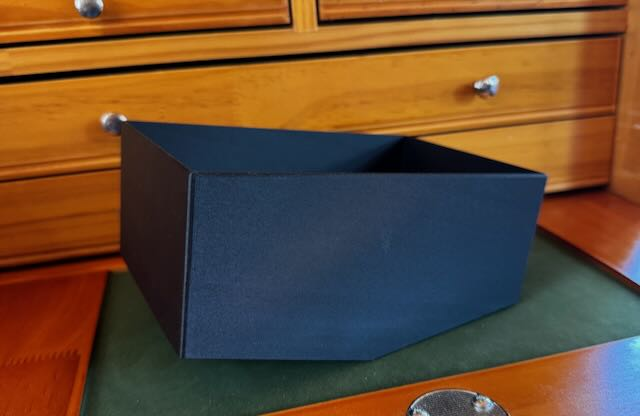

# Dumbbell Rack Accessory Box

The rack for our dumbbells has a v-shaped top and I wanted a small box that would fit on top of it
to store small items. Because of the v-shape on top, I could not just put a box up there, hence this project. Since
the dumbbell rack is steel, there are cutouts in the bottom of the base for magnets to hold it in place.  

The box is parametric, so it can be customized for other applications where you need a box that has a v-shaped base.

## Model Parameters

| Parameter            | Description                                                                         |
| -------------------- | ----------------------------------------------------------------------------------- |
| rack_angle           | Angle of the dumbbell rack top in degrees. This forms the "V" in the v-shaped base. |
| rack_depth           | Depth of the box on the rack in mm.                                                 |
| rack_side_length     | Length of _one side_ of the box on the rack in mm.                                  |
| accessory_box_height | Height of the accessory box once a flat bottom is established.                      |
| corner_rounding      | Rounding diameter for the outside corners of the box.                               |
| wall_thickness       | Thickness of the box wall in mm.                                                    |
| magnet_holes         | True = create cutouts in the base of the box for magnets.                           |
| magnet_diameter      | Diameter of the magnet cutout.                                                      |
| magnet_depth         | Depth of the magnet cutout.                                                         |
|                      |                                                                                     |

## Realized Model

The `dumbbell-accessory-box.stl` file is the box that fits our dumbbell rack:

- 158 degree v-shape on the base.
- 12x2mm cutout for magnets in the base.
- Depth of 115mm.
- Each side of the v-shaped base is 92mm.
- Box height is 70mm.

The `*.3mf` file is a [Orca Slicer](https://orcaslicer.com) project files used to print the 
model on our Prusa MK3S+.

Printing this model did require supports on one side of the v-shaped base.

## Dependencies and Building the 3D Model

This model is built using the tools listed below. Install these tools and you can open up the SCAD file in this repo to create your own printable object. For OpenSCAD, I do recommend the [Development Snapshot](https://openscad.org/downloads.html#snapshots) installation.

- [OpenSCAD](https://openscad.org)
- [The Belfry OpenScad Library, v2.0.](https://github.com/BelfrySCAD/BOSL2)

## Example Output

